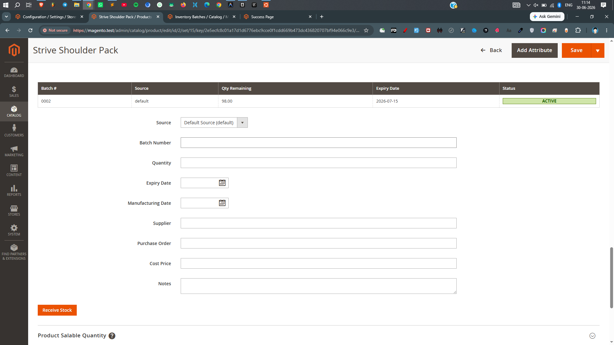
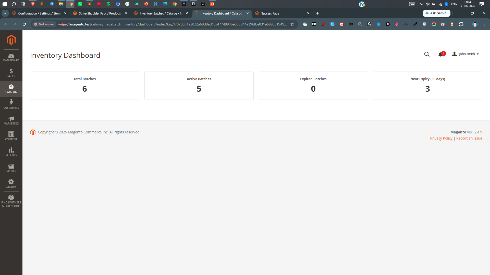
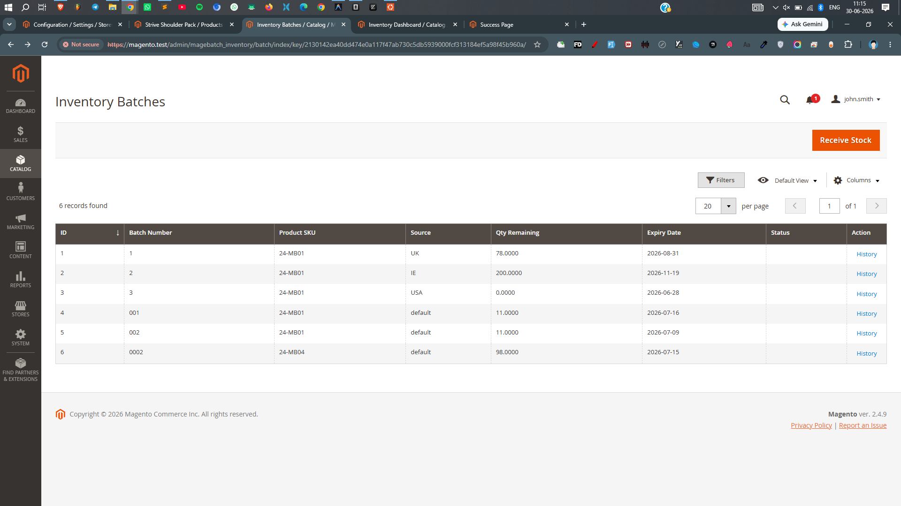
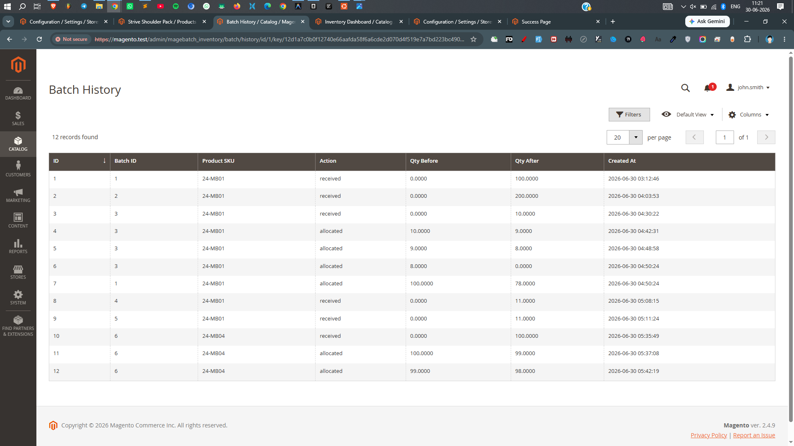
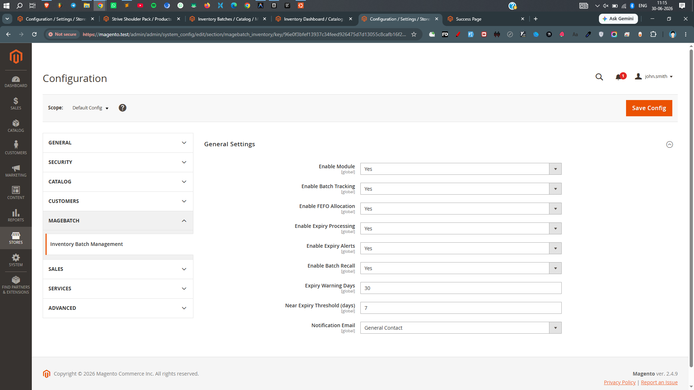

# MageBatch_Inventory

Magento 2 batch inventory management with FEFO allocation, expiry management, recall support, and full audit history.

## Features

- **FEFO Allocation** — First Expiry, First Out algorithm automatically allocates orders from the soonest-expiring batches
- **Batch Tracking** — Track inventory by batch number, source, expiry date, manufacturing date, supplier, PO, cost price
- **Stock Receiving** — Receive stock into batches with automatic Magento source & source item creation
- **Product Page Management** — Receive stock and view batch data directly from the product edit form
- **Status Management** — Active, Sold Out, Expired, Recalled, Damaged, Quarantined, Reserved
- **Audit History** — Full change log for all batch operations (received, allocated, adjusted)
- **Admin Grids** — Browse all batches and history with filtering, sorting, and search
- **Dashboard** — Quick overview of batch stock, expiring soon, and recall status
- **Recall Support** — Flag and manage recalled batches

## Screenshots

### 1. Product Page — Batch Stock Management



The **Batch Stock Management** accordion on the product edit page allows you to view all existing batches for the product in a sortable table (batch number, source, quantity, expiry date, status). Below the table, use the form to receive new stock by entering source, batch number, quantity, expiry date, and optional fields (manufacturing date, supplier, PO, cost price, notes). Click **Receive Stock** to instantly create the batch and update inventory.

### 2. Dashboard



The **Dashboard** provides a quick overview of your batch inventory health:
- Total active batches and units in stock
- Batches expiring within 30 days
- Recalled batches requiring attention
- Recent stock movements and allocations

### 3. Inventory Batches Grid



The **Inventory Batches** grid lists all batch records across products and sources. Use the toolbar to filter, sort, and search batches by ID, batch number, product SKU, source, quantity remaining, expiry date, or status. Each row has a **History** action to view the full audit trail for that batch. Use the **Receive Stock** button to add new inventory.

### 4. History Grid



The **History** grid is the audit log for all batch operations. Every stock movement is recorded with:
- **Timestamp** — When the operation occurred
- **Batch ID** — The affected batch
- **Product SKU** — The product identifier
- **Action** — Type of operation (Received, Allocated, Adjusted, Recalled, etc.)
- **Quantity Change** — Before and after values for full traceability

This provides complete visibility into inventory changes for compliance and troubleshooting.

### 5. Configuration



The module configuration is located at **Stores → Configuration → MageBatch → Inventory**:

| Setting | Description |
|---------|-------------|
| Enable FEFO Allocation | When enabled, orders are automatically allocated from the soonest-expiring batches using the FEFO algorithm. Disable to use standard Magento inventory only. |
| Default Source | The default inventory source code used when no source is specified during stock receiving. |

## Requirements

- Magento 2.4.x
- PHP 8.1+
- Magento Inventory (MSI)

## Installation

```bash
php bin/magento setup:upgrade
php bin/magento setup:di:compile
php bin/magento cache:clean
```

## Configuration

Stores → Configuration → MageBatch → Inventory

| Setting | Description |
|---------|-------------|
| Enable FEFO Allocation | Enables automatic FEFO allocation on order placement |
| Default Source | Default inventory source code |

## Usage

### Receiving Stock

**Product Page:** Open a product → "Batch Stock Management" accordion → fill form → click "Receive Stock"

**Admin Grid:** Inventory Batches → Receive Stock button

### Order Allocation

When FEFO is enabled, orders automatically allocate from the soonest-expiring batches across all sources. Allocation:
1. Reduces batch `qty_remaining`
2. Creates a Magento inventory reservation
3. Logs to audit history

### Batch Statuses

| Status | Description |
|--------|-------------|
| Active | Available for allocation |
| Reserved | Reserved for pending orders |
| Sold Out | Fully depleted |
| Expired | Past expiry date |
| Recalled | Manufacturer recall |
| Damaged | Physically damaged |
| Quarantined | Held for quality review |

## Architecture

```
MageBatch/Inventory/
├── Api/                    # Service contracts & data interfaces
├── Block/Adminhtml/        # Admin dashboard blocks
├── Controller/Adminhtml/   # Admin controllers (CRUD, receive, dashboard)
├── Cron/                   # Scheduled tasks (expiry check)
├── Model/                  # Business logic, resource models
├── Observer/               # Event observers
├── Plugin/                 # Magento plugins (reservation, product form)
├── Ui/                     # UI components, data providers, action columns
├── view/adminhtml/         # Admin templates, JS, layouts
└── etc/                    # Module config, routes, ACL, schema
```

## Extensibility

### Service Contracts

- `BatchRepositoryInterface` — CRUD for batches
- `FefoAllocationInterface` — FEFO allocation logic
- `StockReceivingInterface` — Stock receiving
- `HistoryRepositoryInterface` — Audit history

### Plugins

| Plugin | Target | Purpose |
|--------|--------|---------|
| `InventoryReservationPlacing` | `PlaceReservationsForSalesEventInterface` | FEFO allocation on order |
| `ProductFormMetaPlugin` | `ProductDataProvider::getMeta()` | Batch accordion on product page |

## Database Schema

- `magebatch_inventory_batch` — Batch records
- `magebatch_inventory_reservation` — FEFO reservation tracking
- `magebatch_inventory_history` — Audit log

## License

Proprietary
